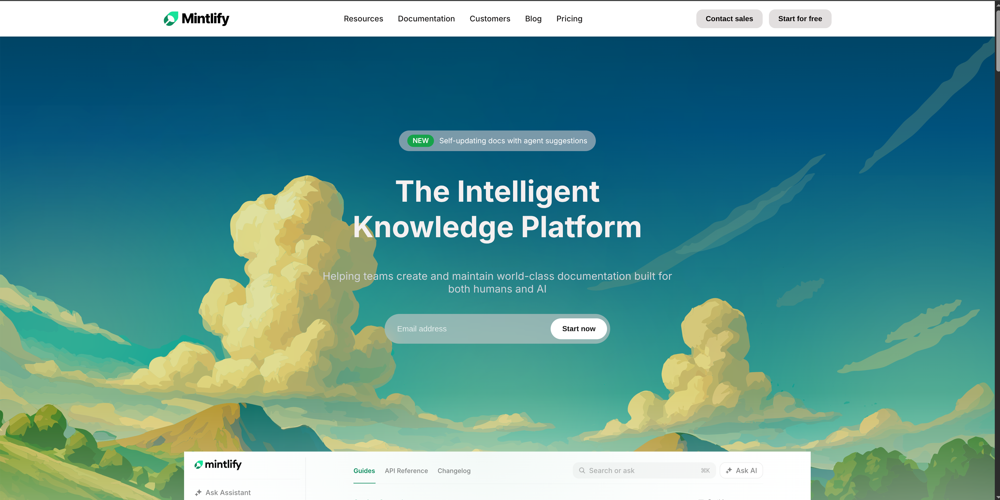
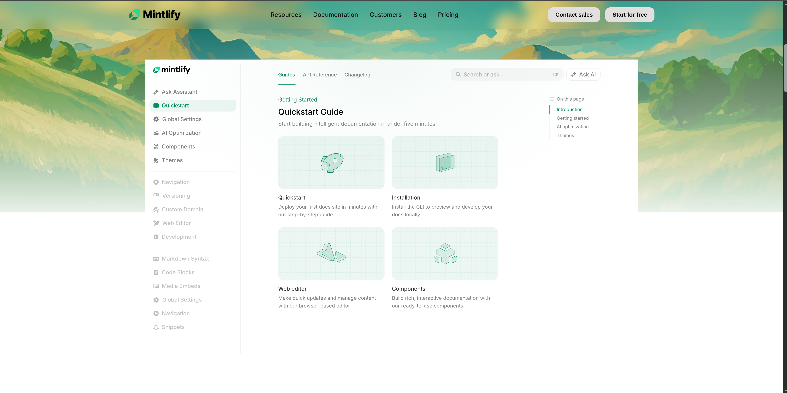
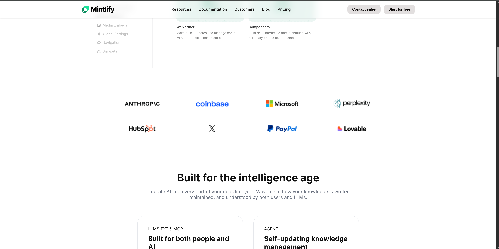
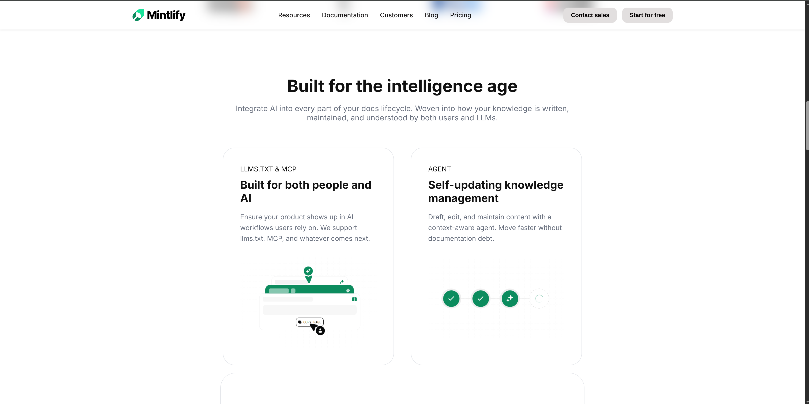
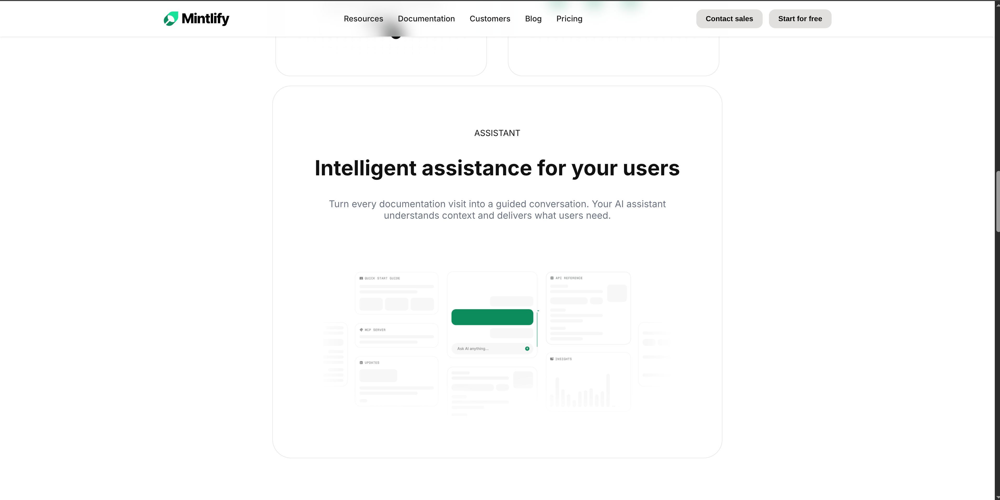
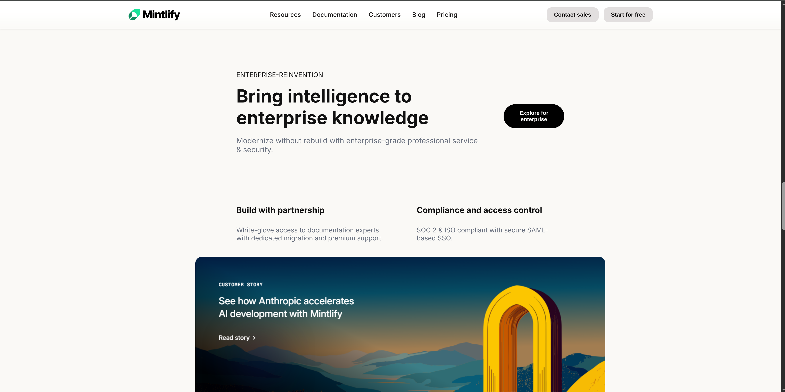
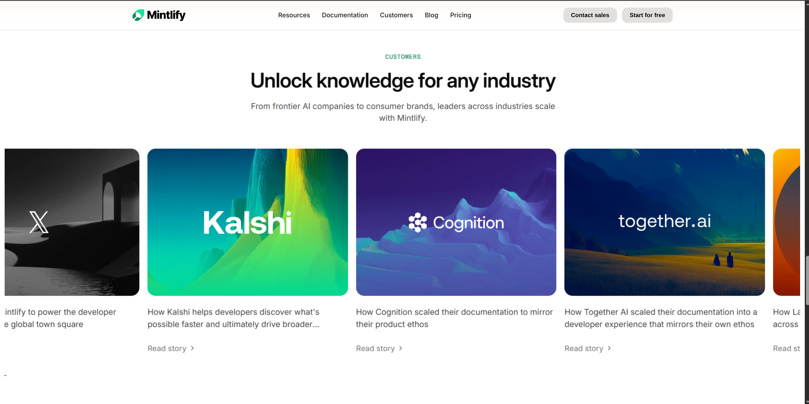
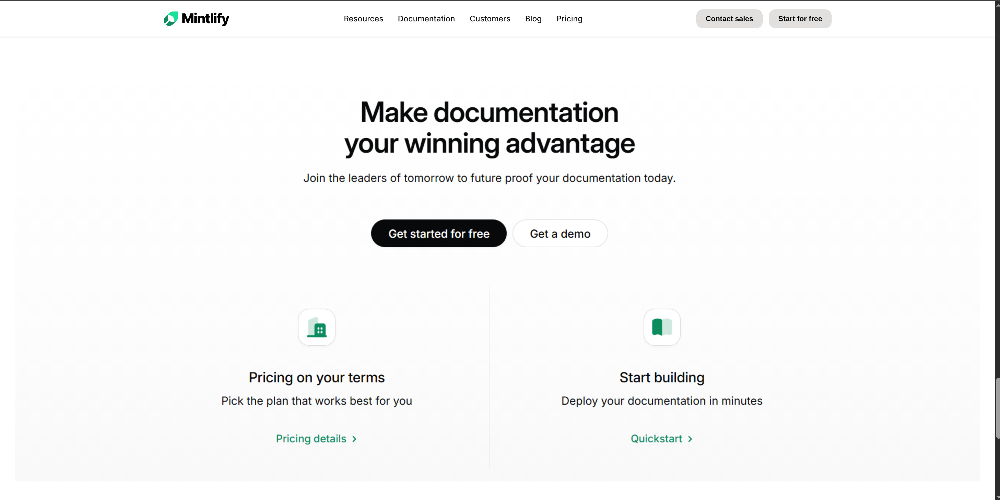
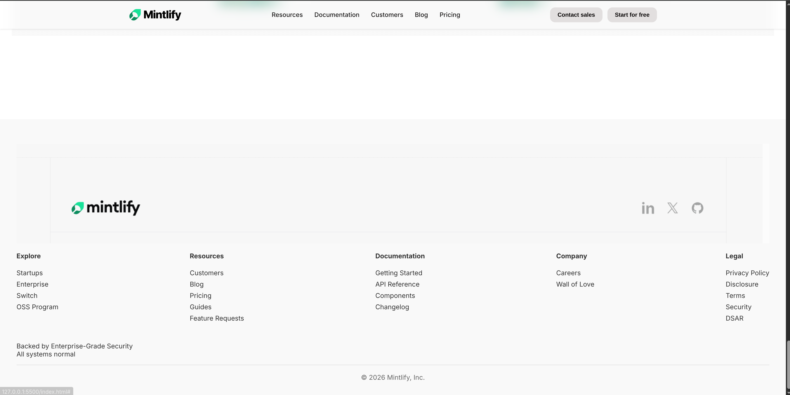

# Cursor-Website-UI-Clone-HTML-CSS

This repository contains a desktop-only UI clone of the Cursor website created using pure HTML and CSS.

The objective of this project was to closely recreate the layout, visual style, and main sections of the original website while following all given constraints.

---

## Sections Recreated

### 1. Top Navigation Bar
- Logo  
- Navigation links  
- Primary call-to-action button  

### 2. Hero Section
- Main headline  
- Short description  
- CTA button  
- Large background illustration  

### 3. Documentation Preview Section
- Static sidebar-style navigation  
- Main content preview cards  

### 4. Trusted By / Logos
- Row of company logos  

### 5. Feature Highlights
- Two-column layout with text and visuals  

### 6. Intelligent Assistant / UI Preview
- Large product UI mockup  
- Supporting description  

### 7. Enterprise Features Section
- Section title and short intro  
- Feature blocks (security, compliance, scale, etc.)  

### 8. Case Studies / Customer Stories
- Card-based layout with images and text  

### 9. Final Call-To-Action
- Strong headline  
- CTA button  

### 10. Footer
- Multi-column navigation links  
- Company and legal information  

---

### Font Used
- System UI font stack (similar to original site)

### Color Palette
- Background: `#14120b`  
- Primary text: `#edecec`  
- Buttons: `#edecee`  
- Hover states: `#edecec7b`  
- Accent links: `#f54e00`  

---

## Screenshots

